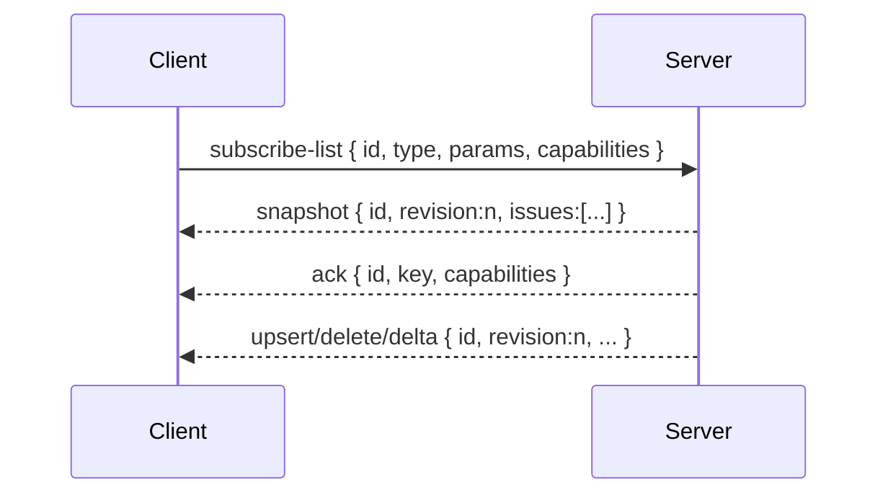
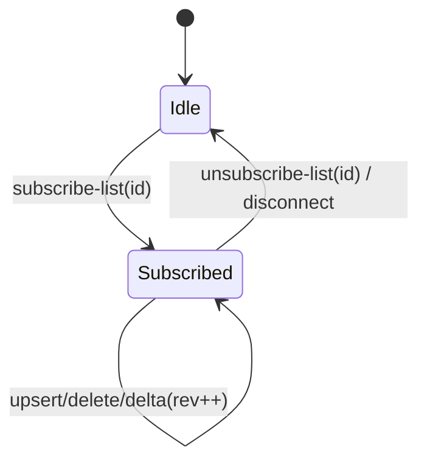

# Subscription Push Protocol — per‑subscription full‑issue envelopes (Breaking)

```
Date: 2025-10-26
Amended: 2026-07-10
Status: v2 implemented; subscription-delta-v1 accepted, implementation pending
Owner: agent
```

This document specifies the push‑only protocol used by beads‑ui to deliver list
updates from the local server to the client. It replaces the legacy
notify‑then‑fetch model. The base v2 migration has no fallback to that legacy
model. The additive `subscription-delta-v1` extension uses per-subscription
capability negotiation and retains the base v2 full-issue envelopes as its
fallback.

## Overview

- Transport: single WebSocket connection per client
- Encoding: JSON text frames
- Subscriptions: one client‑chosen `id` per active list subscription
- Delivery: per‑subscription envelopes with full issue payloads
- Messages: `snapshot` | `upsert` | `delete` | capability-gated `delta`
- Ordering: strictly increasing `revision` per subscription key and connection

## Envelopes

```ts
export type SnapshotEnvelope = {
  type: 'snapshot';
  id: string; // client subscription id
  revision: number; // key-scoped; this id may first observe a value greater than 1
  issues: Issue[]; // full list for this subscription
  truncated?: boolean; // exact on capable servers; missing on older servers
};

export type UpsertEnvelope = {
  type: 'upsert';
  id: string;
  revision: number;
  issue: Issue; // full issue payload
};

export type DeleteEnvelope = {
  type: 'delete';
  id: string;
  revision: number;
  issue_id: string; // id only
};

export type DeltaEnvelope = {
  type: 'delta';
  id: string;
  revision: number;
  upserts: Issue[];
  deletes: string[];
};
```

Notes

- Server serializes refresh runs per subscription key and emits envelopes in
  `revision` order. Clients MUST ignore any envelope with `revision <=` the last
  applied for the same `id`.
- The revision counter belongs to the normalized subscription key on one
  WebSocket connection. Its first event is revision 1. Multiple client ids may
  share that key, so one id can observe gaps or receive an initial snapshot with
  a revision greater than 1. Each id still observes a strictly increasing
  sequence.
- Clients SHOULD treat `upsert` as idempotent and MAY additionally guard on an
  `issue.updated_at` timestamp to ignore stale updates racing with local state.
- A `delta` is one atomic revision. Clients MUST validate the complete envelope
  before changing local state, apply all accepted upserts and deletes, advance
  the revision once, sort once, and notify listeners once.
- Revisions are monotonic but need not be contiguous. A capable client MUST
  continue accepting legacy `upsert` and `delete` envelopes.

## Handshake (subscribe‑list)

Client subscribes to a list with a chosen `id`, a `type`, optional `params`, and
optional transport `capabilities`.

Client → Server

```json
{
  "id": "req-1",
  "type": "subscribe-list",
  "payload": {
    "id": "ready",
    "type": "ready-issues",
    "capabilities": ["subscription-delta-v1"]
  }
}
```

Capability validation is part of the inbound protocol boundary:

- The client subscription `id` MUST encode to 1 through 128 UTF-8 bytes and MUST
  NOT contain ASCII control characters.
- `capabilities` MAY be omitted. When present, it MUST be an array with at most
  8 entries.
- Each entry MUST be a string of 1 to 64 ASCII characters matching
  `^[a-z0-9][a-z0-9._-]{0,63}$`.
- Duplicate entries are normalized to one value. Well-formed unknown entries are
  ignored for forward compatibility.
- The only capability defined here is `subscription-delta-v1`.
- Capabilities are connection-local delivery preferences. They MUST NOT be
  included in `params`, the normalized subscription spec, or the shared
  subscription key.

Malformed or excessive capability input fails the request with `bad_request`.
Missing, empty, or unknown-only capabilities select legacy `upsert` and `delete`
delivery.

### Resource and backpressure bounds

- One connection MAY reserve at most 32 distinct client subscription ids across
  active subscriptions and pending initial fetches. The server reserves an id
  before fetching. A request beyond that limit fails with `resource_limit` and
  does not attach or fetch. Replacing the same id keeps one reservation and
  transfers it to the newest intent. A stale completion MUST NOT release a newer
  intent's reservation. The reservation is released only when that id has
  neither an active subscription nor a current pending intent, including after
  current-intent failure, unsubscribe, or disconnect.
- Subscription types and params remain server allowlisted. The server MUST NOT
  accept an arbitrary client-provided result limit.
- The base list ceiling remains 1000 issues until the separate benchmark and
  cap-lift gates approve a different finite server-owned value.
- The ceiling applies to every list subscription except one-item `issue-detail`,
  including epics and blocked lists whose CLI commands lack a limit flag.
  Commands with limit support request at most `ceiling + 1`; other CLI results
  are server-sliced after parsing. This bounds registry, wire, and client state
  but does not bound an unfilterable CLI command's output; the large-list
  benchmark gate measures that remaining server cost.
- A delta cannot create a larger payload class than a bounded snapshot. Server
  implementation MUST retain a finite snapshot ceiling.
- New servers include an exact `truncated` boolean in snapshots. They determine
  it by fetching at most one item beyond the effective ceiling when the command
  supports a limit. For an unlimitable command, `truncated` is
  `raw_result_length > ceiling` before server slicing. Older servers omit the
  field; a capable client treats a missing value as unknown and MAY show a
  conservative boundary notice.
- The default maximum encoded push frame and socket high-water mark are both 8
  MiB. Before sending, the server checks `bufferedAmount + encoded_frame_bytes`.
  A subscription whose initial snapshot exceeds the frame maximum or the
  prospective socket high-water mark fails with `resource_limit` and does not
  attach. If an unsolicited update would exceed either bound, the server MUST
  NOT send a partial change set or drop one incremental frame; it closes the
  connection with WebSocket code 1013 so reconnect produces a complete snapshot.
  Implementations MAY expose bounded server configuration overrides.

The server fetches and attaches the subscription, then enqueues the initial
`snapshot` before the successful request acknowledgement. WebSocket ordering
therefore presents the snapshot first when both frames are delivered. Clients
MUST register snapshot handlers before sending `subscribe-list` and MUST NOT
depend on the acknowledgement arriving first. Encoding, size validation, or
snapshot enqueue failure MUST detach the subscription and suppress the success
acknowledgement; this guarantees successful enqueue, not remote receipt.

Server → Client

```json
{
  "id": "req-1",
  "ok": true,
  "type": "subscribe-list",
  "payload": {
    "id": "ready",
    "key": "ready-issues",
    "capabilities": ["subscription-delta-v1"]
  }
}
```

The acknowledgement reports only capabilities recognized and selected by the
server. It is diagnostic; the client supports legacy and delta events without
waiting for it.

`status-issues` accepts exactly one `params.statuses` string containing a
comma-separated combination of `open`, `in_progress`, and `closed`. The server
deduplicates and canonicalizes the values in that order. Existing subscription
types remain supported.

```json
{
  "id": "evt-1730000000000-1",
  "ok": true,
  "type": "snapshot",
  "payload": {
    "type": "snapshot",
    "id": "ready",
    "revision": 1,
    "issues": [{ "id": "UI-1", "title": "..." }]
  }
}
```

## Updates

Subsequent refreshes emit `upsert` and `delete` envelopes as the list changes.
Once `subscription-delta-v1` is implemented and selected, a refresh with two or
more total changes emits one `delta` instead. A one-change refresh retains the
smaller legacy envelope. Empty refreshes emit nothing. Initial snapshots are
unchanged.

```json
{
  "id": "evt-1730000000100-2",
  "ok": true,
  "type": "upsert",
  "payload": {
    "type": "upsert",
    "id": "ready",
    "revision": 2,
    "issue": { "id": "UI-2", "status": "in_progress" }
  }
}
```

```json
{
  "id": "evt-1730000000200-3",
  "ok": true,
  "type": "delete",
  "payload": {
    "type": "delete",
    "id": "ready",
    "revision": 3,
    "issue_id": "UI-9"
  }
}
```

Capable update with two upserts and one delete:

```json
{
  "id": "evt-1730000000300-4",
  "ok": true,
  "type": "delta",
  "payload": {
    "type": "delta",
    "id": "ready",
    "revision": 4,
    "upserts": [
      { "id": "UI-2", "status": "in_progress" },
      { "id": "UI-3", "status": "open" }
    ],
    "deletes": ["UI-9"]
  }
}
```

### Delta invariants

- `upserts` and `deletes` MUST both be arrays. Their combined length MUST be at
  least 2 for a server-emitted delta.
- Every upsert MUST be a full issue object with a non-empty string `id`.
- Every delete MUST be a non-empty string issue id.
- An issue id MUST occur at most once in each array and MUST NOT occur in both
  arrays.
- The server orders both arrays lexicographically by issue id for deterministic
  encoding and tests. Array order has no mutation precedence because the id sets
  are disjoint.
- The client validates the entire envelope before applying it. An empty,
  malformed, duplicate, or overlapping delta MUST NOT be partially applied.
- After rejecting an invalid delta, the client marks that subscription
  desynchronized and re-subscribes for a fresh snapshot before accepting more
  incremental events for that id.
- A stale delta with `revision <= last_revision` is ignored like any other stale
  envelope.

## Reconnect Behavior

- On reconnect, clients resubscribe using the same `id` values as needed. The
  server treats this as a new connection and sends a fresh `snapshot` for each
  active subscription. The new connection restarts each key-scoped counter at 1,
  but ids sharing a key can receive different initial revision values.
- Clients that support `subscription-delta-v1` resend the same capability on
  every reconnect. Capabilities are not retained across WebSocket connections.
  Clients reset each local store's revision state before accepting its first
  reconnect snapshot.

## Diagrams





## Client Responsibilities

- Maintain one `SubscriptionIssueStore` per active subscription `id`.
- Apply envelopes strictly in `revision` order; ignore stale revisions.
- Validate a delta completely and apply it atomically. On invalid delta, stop
  incremental application for that id and re-subscribe for a fresh snapshot.
- Render list components from `store.snapshot()` (deterministic order).
- Dispose stores on route/tab changes.

Detail view

- Detail pages use the same mechanism with a single‑item subscription, e.g.
  `{ type: 'issue-detail', params: { id: 'UI-1' } }` under a client id like
  `detail:UI-1`. The server returns a one‑element list for `snapshot` and
  `upsert` events.

## Rollout and Compatibility

- The base v2 breaking change still has no compatibility layer with the old
  notify‑then‑fetch or id-only delta flow.
- `subscription-delta-v1` is an additive full-issue delivery capability. Its
  legacy fallback remains supported for the lifetime of protocol v2. Removing
  `upsert` or `delete` requires a new major protocol ADR and migration plan.

| Client        | Server        | Result                                                |
| ------------- | ------------- | ----------------------------------------------------- |
| Current       | Current       | Legacy full-issue `snapshot`/`upsert`/`delete`        |
| Current       | Delta-capable | No capability requested; legacy full-issue events     |
| Delta-capable | Current       | Unknown top-level field is ignored; legacy events     |
| Delta-capable | Delta-capable | Snapshot plus selected legacy or atomic delta updates |

Mixed capable and legacy client ids MAY share the same registry key. Delivery
format is selected per client id, not per registry key or WebSocket connection.

## See Also

- ADR 002 — Per‑Subscription Stores and Full‑Issue Push
- `docs/data-exchange-subscription-plan.md` (server refresh and publish model)
- `docs/subscription-issue-store.md` (store API and usage examples)
